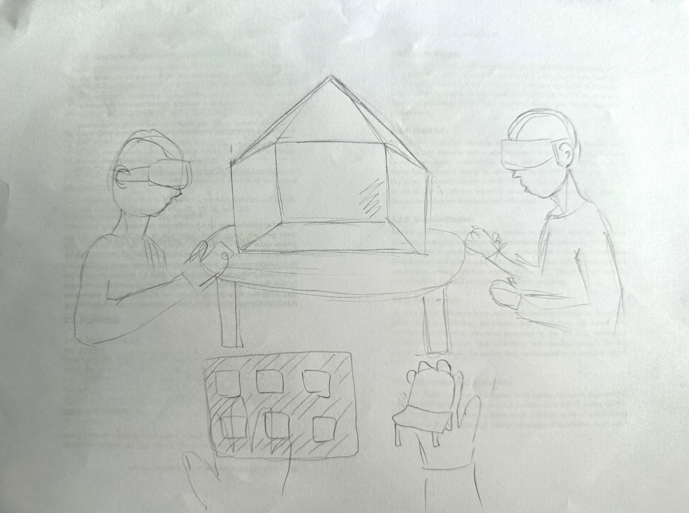
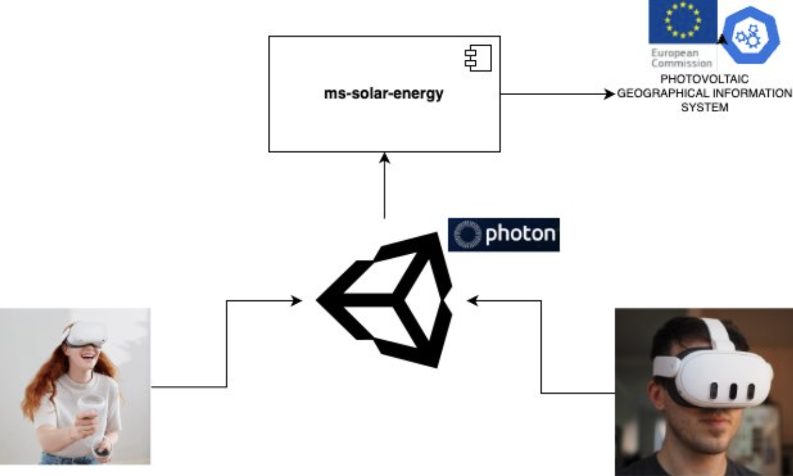
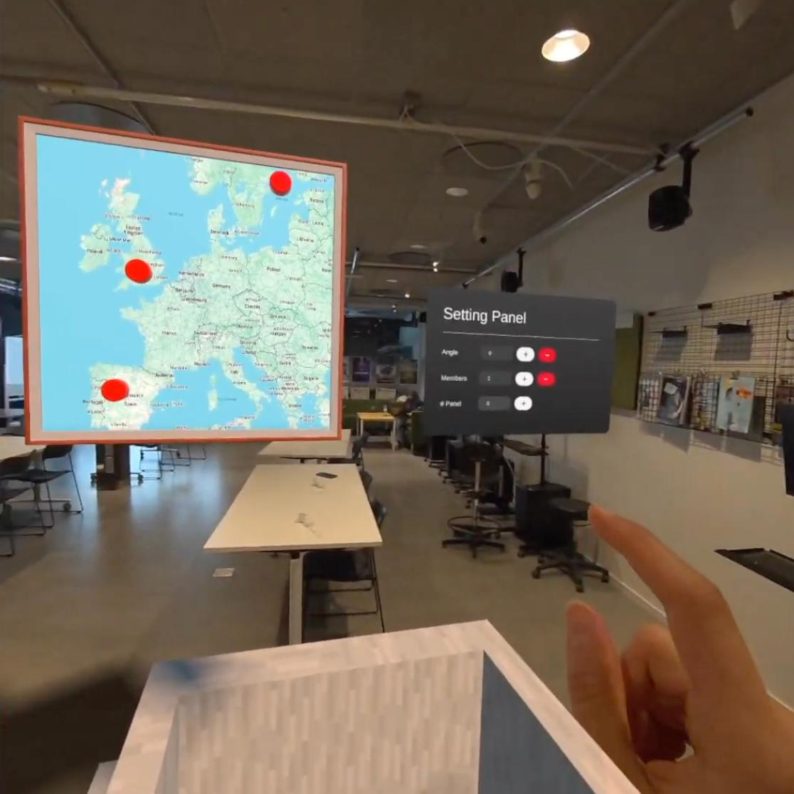
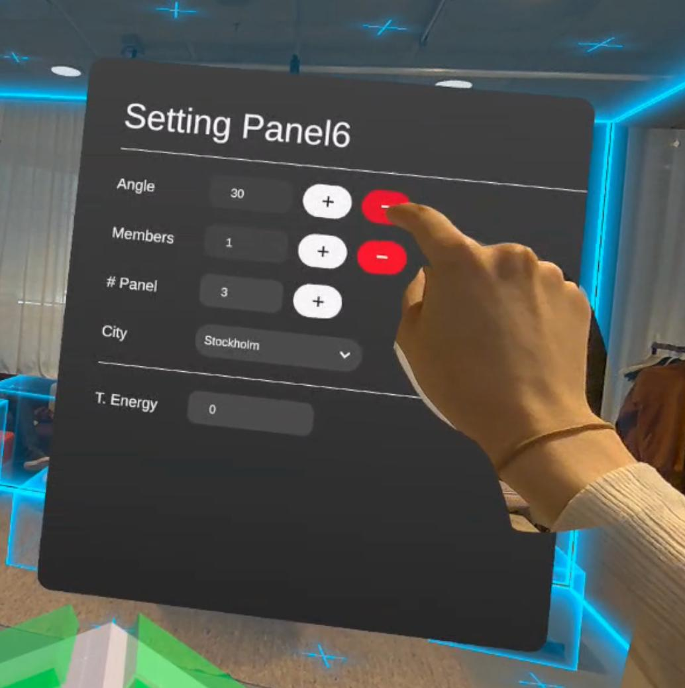
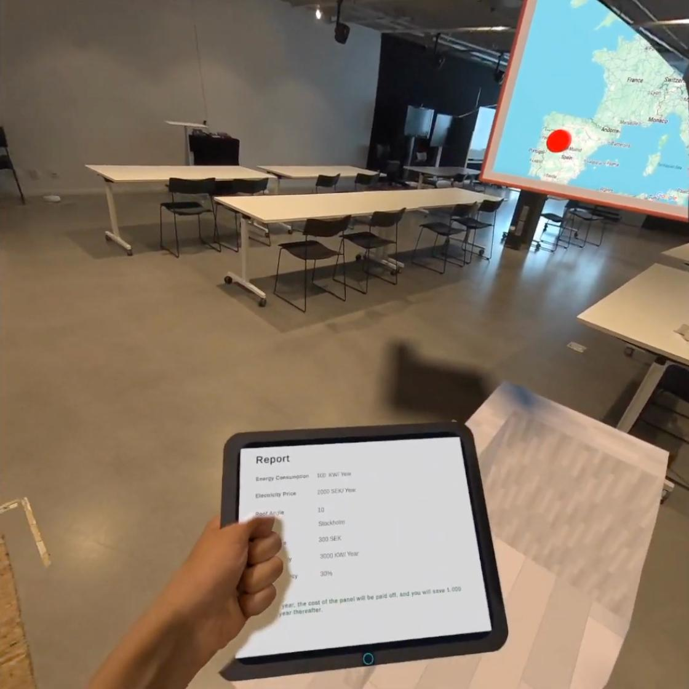

# SOLAR_XR

## Explore the benifits of the solar panels with real-time statistics for your house in Mixed Reality!

## Introduction

This project is a Mixed Reality project about **Solar Panels** and their efficientency and benifits specificlly for your location

---

## Design Process

The Design Process started with a **brainstorming session**, where each of us focused on ideas to create immersive project, following **Digital Twins** concept.

  

---
## Digital Twin with solar Panel

In this project, we propose the development of a Digital Twin of a residential house using Unity. This virtual representation will allow users to interactively explore the installation and performance of solar panels under different conditions, such as roof tilt angles and panel quantities. The Digital Twin will be enriched with real-world data obtained from the Photovoltaic Geographical Information System (PVGIS), provided by the **European Commission’s Joint Research Centre** (JRC) through their public dataset (https://re.jrc.ec.europa.eu/pvg_tools/en/). By integrating this reliable dataset into the simulation, the system can provide realistic estimations of solar energy production based on geographical location, roof orientation, and other environmental parameters. This solution not only offers an interactive way to visualize and understand solar energy potential but also supports collaborative adjustments through Photon for multi-user experiences. 

---

### Architecture Diagram

order to understand how we can obtain information about the energy produced by solar panels depending on their installation angle, a web service has been developed. This service uses data provided by the [Photovoltaic Geographical Information System (PVGIS)](https://joint-research-centre.ec.europa.eu/photovoltaic-geographical-information-system-pvgis_en). Additionally, we will use Photon to enable this interaction to be collaborative.

  

---

### User Testing

The demo version of the experience was presented and tested by several people, providing us valuable feedback to improve the experience. Based on this feedback, we adjusted our presentation of how the experience would look, as well as made minor changes to gameplay and UI elements (such as the Menu) to make the experience smoother for users.

---

## System Description

### Features

Solar_XR includes the following features:

- A **virtual house** where users can control their surroundings, such as adjusting the level of sound, light flickering, and controlling people’s movements.
- An **configuration panel** that leads users to the Safe Space if they feel uncomfortable and wish to stop the experience.
- An **interactive map**, which contains three buttons to select the city that will be used as the reference for displaying the solar energy produced in that location.
- A **virtual tablet**, where the user can view information such as the number of inhabitants in the house, the potential energy savings, the number of installed solar panels, and the roof’s tilt angle.

---

#### [Watch the DEMO VIDEO or try out the live version](https://drive.google.com/file/d/1TLQLkP2sWuyGZj6iuh0IJgn3bl3QgaqV/view)

---

## Installation

To install and run "SolarXR", follow the instructions below.

### Software

 **1. Setting Up Unity Hub** 
Download and install Unity Hub from [official page](https://unity.com/download)

**2. Installing Unity Editor and Required Modules**
In Unity Hub, go to the 'Installs' tab and click on the 'Add' button to install a new version of the Unity Editor. Select Unity Editor LTS version 2022.3.56f1
Also, during the installation setup, you should select the following options: 
- Microsoft Visual Studio IDE (for code editing). 
- Android Build Support 

  

**3. Configuring  Unity Project**  
**a. Import the Meta XR SDK:**  
- Navigate to Window > Package Manager.
- Click the '+' icon and select 'Add package by name'.
- Enter 'com.meta.xr.sdk.all' and click 'Add'. Restart Unity if prompted.
- The version used in this project was 71.0.0

  

**b. Build Setting Configuration:**  
 - Go to File > Build Settings 
 - select 'Android' as the target platform. 
 - Click 'Switch Platform' to confirm.
 - On Scenes in Build add: startup-environment, design-environment and safety-environment 

  

---

| **Platform** | **Device** | **Requirements**                            | **Commands**                                                                                                                                          |
| ------------ | ---------- | ------------------------------------------- | ----------------------------------------------------------------------------------------------------------------------------------------------------- |
| Windows      | Meta Quest | Unity 2022.3 or higher, Arduino             | `git clone https://github.com/user/repo.git` `cd project-xr` `open MainScene.unity` `Build and Run`                                          |
| Android      | Phone      | Android 19 or higher, ARCore 1.18 or higher | `git clone https://github.com/user/repo.git` `cd solar-system-xr` `open SolarSystemXR.unity` `switch platform to Android` `build and run` |

You also need to install the following dependencies or libraries for your project:

- A Unity plugin for building VR and AR experiences

---

## Usage

To use SolarXR and interact with its features, follow the guidelines below:

1. The game is not stationary and uses hand tracking.
2. Open SolarXR application on your VR headset.
3. Once in the application, you will see a house and panels, start the expirience by pressing buttons on the panels and adjusting parameters for your needs.

  
  
  

---

## References

3D Assets:

- https://assetstore.unity.com/packages/3d/props/level-design-modular-starter-pack-288972
- https://assetstore.unity.com/packages/3d/props/industrial/high-quality-solar-panel-175231

---

## Contributors

Evgeniia Dolgikh  
evdo4579@student.su.se  
[Linkedin](https://www.linkedin.com/in/evgeniiadolgikh/)

Fatereh Tondro 
fato3435@student.su.se  
[Linkedin](https://www.linkedin.com/in/fatereh-tondro/)

Ernesto Galarza  
erga4586@student.su.se  
[Linkedin](https://www.linkedin.com/in/ernestoagc/)  
